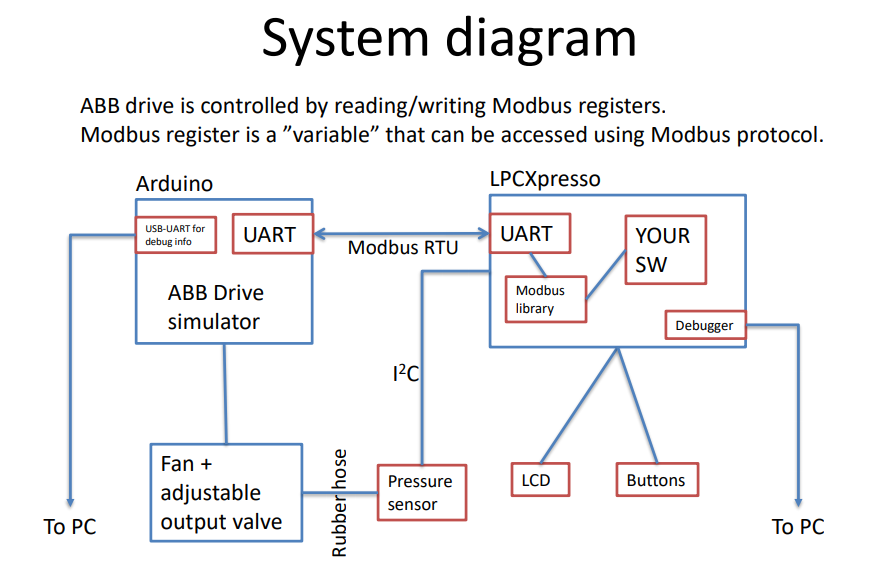

# EmbeProge
Github repository for Metropolia Smart Systems major, embedded systems programming course project (Spring 2020)

The goal was to develop a fanning system using LPC1549 chip and ACH550 drive.
The project was done in a three-person project team.

